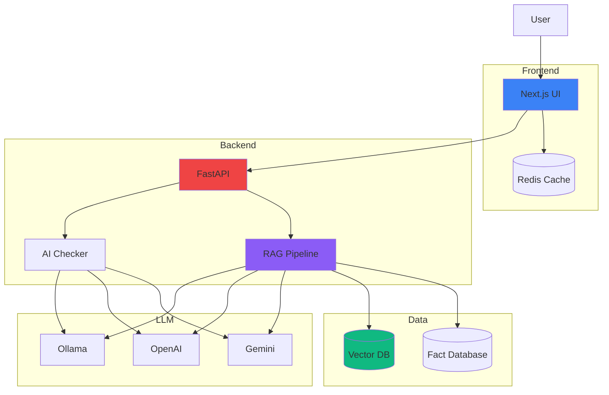
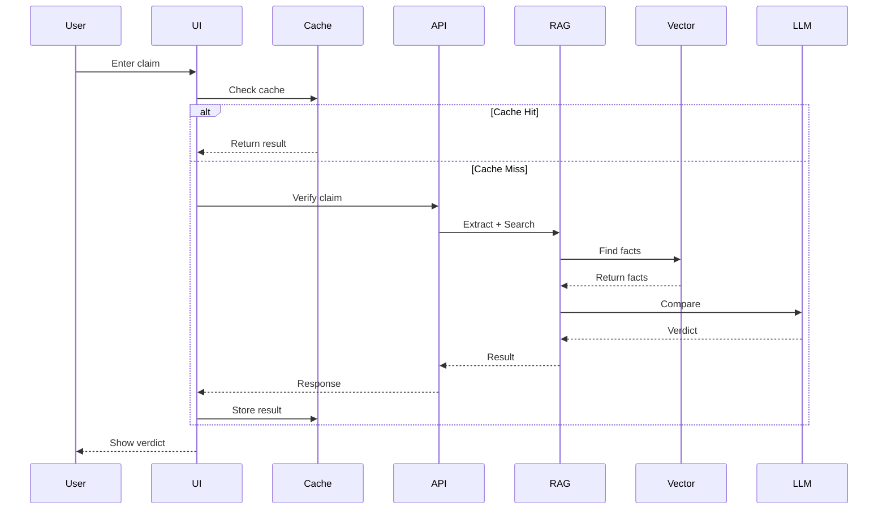
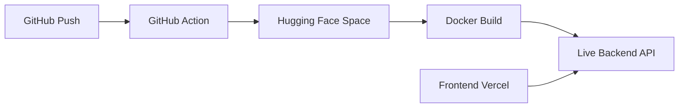

# Architecture

## System Overview



## RAG Pipeline


## Request Flow



## Components

### Frontend (Next.js)

**UI** (`app/page.tsx`)
- Dual-mode toggle (RAG/AI)
- Real-time loading states
- Confidence visualization
- Feedback system

**API Routes** (`app/api/`)
- `/api/rag/verify` - RAG verification
- `/api/verify` - AI verification
- `/api/rag/feedback` - User feedback

**Cache** (Redis)
- 1-hour TTL
- Cache-aside pattern
- Works without Redis

### Backend (FastAPI)

**RAG Pipeline** (`services/rag_pipeline.py`)

4 stages:
1. **Claim Extraction** (50-100ms) - spaCy NER
2. **Vector Retrieval** (100-200ms) - ChromaDB search
3. **LLM Comparison** (1-3s) - Evidence analysis
4. **Response Format** (10-20ms) - Add metadata

**Claim Extractor** (`services/claim_extractor.py`)
- Extracts entities: PERSON, ORG, MONEY, DATE
- Uses spaCy NLP
- Fallback to original text

**Vector Retriever** (`services/vector_retriever.py`)
- Embedding: SentenceTransformers (384-dim)
- Database: ChromaDB
- Similarity threshold: 0.3
- Returns top-5 facts

**LLM Comparator** (`services/llm_comparator.py`)
- Compares claim vs evidence
- Returns: verdict, confidence, reasoning
- Supports: Gemini, OpenAI, Ollama

**Fact Base Manager** (`services/fact_base_manager.py`)
- Loads PIB facts from JSON
- Pre-computed embeddings
- Manages fact database

### Data Layer

**Fact Database** (`data/fact_base.json`)
```json
{
  "facts": [
    {
      "id": "pib-2024-001",
      "claim": "Government announces...",
      "category": "agriculture",
      "source": "https://pib.gov.in/...",
      "publication_date": "2024-01-15",
      "embedding": [0.123, -0.456, ...]
    }
  ]
}
```

**Feedback Logs** (`logs/feedback.jsonl`)
```json
{"feedback_id":"fb_123","claim":"...","helpful":true,"timestamp":"2026-01-16T12:00:00Z"}
```

## API Reference

### POST /rag/verify
```json
Request:  {"claim": "text"}
Response: {
  "verdict": "true|false|unverifiable",
  "confidence": 0.92,
  "explanation": "...",
  "evidence": [...],
  "sources": [...]
}
```

### POST /verify
```json
Request:  {"claim": "text"}
Response: {
  "verdict": "true|false|uncertain",
  "confidence": 0.85,
  "explanation": "..."
}
```

### POST /feedback
```json
Request:  {"claim_id":"123","helpful":true}
Response: {"success":true}
```

## Performance

**Response Times:**
- Cache hit: <50ms
- RAG mode: 1.2-3.5s
- AI mode: 1-2s

**Bottlenecks:**
- LLM API: 1-3s
- Vector search: 100-200ms

**Optimizations:**
- Redis caching (1h TTL)
- Pre-computed embeddings
- Async operations

## Deployment Pipeline


## Tech Stack

| Layer | Technology |
|-------|-----------|
| Frontend | Next.js 16, React 19, Tailwind CSS |
| Backend | FastAPI, Uvicorn |
| LLM | Gemini, OpenAI, Ollama |
| Vector DB | ChromaDB |
| Embeddings | SentenceTransformers |
| NLP | spaCy |
| Cache | Redis |
| Testing | Vitest, Pytest |
